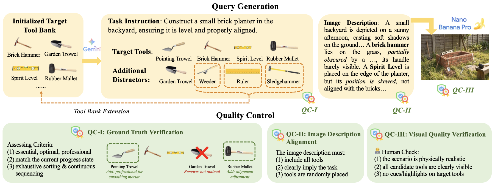

<a name="readme-top"></a>

<div align="center">
  
  <h1 align="center">Beyond APIs: Probing the Limits of MLLMs in Physical Tool Use</h1>
</div>

<div align="center">

  <!-- Project Page -->
  <a href="{project_page_url}">
    
  </a>

  <!-- Paper Link -->
  <a href="{paper_url}">
    
  </a>

  <!-- HuggingFace Datasets -->
  <a href="https://huggingface.co/datasets/ModalityDance/PhysTool-Bench">
    
  </a>

</div>


Welcome to **PhysTool-Bench**! 👋PhysTool-Bench is a benchmark that tests how well Multimodal Large Language Models (MLLMs) can use physical tools in real-world scenes. It checks whether a model can spot the right tools in a messy image, understand what they’re for, and plan the correct order to use them—skills that current MLLMs lack. Researchers get a clear way to measure physical commonsense separately from visual recognition, which helps improve embodied AI for domains like manufacturing, healthcare, and agriculture. The repository includes 2,510 test scenarios, 2,678 real-world tools, evaluation code, and human-verified ground-truth labels.


### 🪐 Key Features

🔍 **Two‑Task Design** 
Separates tool recognition (find everything in the scene) from task‑driven selection & ordering (choose and sequence the right tools). This reveals whether a model fails because it can’t see the tools or because it doesn’t understand how to use them.

🛠️ **Real‑World Tool Variety**
Covers 2,678 tools from 57 categories (farming, electrical, healthcare, etc.). Each scene contains ~9 tools with many distractors, mimicking real clutter.

💭 **Challenging Distractors**
Every task includes 3–10 misleading tools that look or work similarly to the correct ones. Models must reject plausible wrong answers.

📊 **Rich Evaluation Metrics**
Reports Exact Match (perfect tool set + order), Task‑Completable Rate (allows extra tools), and Success@k (first k steps). No single number hides the real failure modes.

📦 **Ready‑to‑Use Benchmark**
Provides all prompts, scene descriptions, and human‑checked images. Code and data are available to run on 13+ leading MLLMs (GPT, Gemini, Qwen, etc.).


<div align="center">
  <figure>
    
    <br>
    <figcaption><em>Quick Overview of Project Name.</em></figcaption>
  </figure>
</div>


## 🔥 News 

<div style="max-height: 240px; overflow-y: auto;">

- **[2026.06]** Initial release of PhysTool-Bench.

</div>


## 📑 Table of Contents <span id="table-of-contents"></span>


* <a href='#quick-start'>🚀 Quick Start</a>
  * <a href='#installation'>Installation</a>
  * <a href='#data'>Data</a>
  * <a href='#running'>Running</a>
<!-- * <a href='#examples'>⬇️ Examples</a> -->
* <a href='#how-it-works'>✨ How It Works</a>
<!-- * * <a href='#documentation'>📖 Documentation</a> -->
<!-- * <a href='#todo'>📝 TODO List</a> -->
* <a href='#acknowledgements'>🌱 Acknowledgements</a>
* <a href='#citation'>📚 Citation</a>


## 🚀 Quick Start <span id="quick-start"></span>


### 1. Installation <span id="installation"></span>

Since different models require conflicting versions of transformers and other libraries, we provide separate Conda environments for running different model families. Choose the one that matches the model you want to evaluate.

#### **Conda (recommended)**

For Open-Flamingo
```
conda create -n flamingo_env python=3.10 -y
eval "$(conda shell.bash hook)" && conda activate flamingo_env

pip install torch==2.4.0 torchvision==0.19.0 torchaudio==2.4.0 --index-url https://download.pytorch.org/whl/cu121
pip install transformers==4.28.1
pip install open-flamingo==2.0.1 --no-deps
pip install einops einops-exts open_clip_torch huggingface-hub Pillow accelerate sentencepiece
```

For mPLUG-Owl3
```
conda create -n mPLUG_env python=3.10 -y
eval "$(conda shell.bash hook)" && conda activate mPLUG_env

pip install torch==2.7.0 torchvision torchaudio --index-url https://download.pytorch.org/whl/cu118
pip install transformers==4.40.2
pip install icecream einops 'accelerate>=0.26.0' pillow
```

For MiniCPM
```
conda create -n minicpm_env python=3.10 -y
eval "$(conda shell.bash hook)" && conda activate minicpm_env

pip install --upgrade torch torchvision torchaudio --index-url https://download.pytorch.org/whl/cu124
pip install "transformers<5.0.0" "timm>=1.0.0" "accelerate>=1.0.0"
pip install sentencepiece pillow decord einops minicpmo hyperpyyaml speechbrain librosa onnx onnxruntime-gpu
```

#### **Hardware Requirements (recommended to fill)**

* GPU: Recommended for training and inference (CUDA-compatible)
* Python: **3.10**
* CUDA: **12.1 / 12.4**
* Frameworks: **PyTorch 2.4.0, Transformers (version varies per model), Accelerate**


### 2. Data Preparation <span id="data"></span>

#### **Download datasets**

```bash
chmod +x scripts/download_data.sh
./scripts/download_data.sh
```

or download manually from:

* https://huggingface.co/datasets/ModalityDance/PhysTool-Bench


### 3. Running <span id="running"></span>

#### **Task I Inference**

Throught API:
```bash
python scripts/inference/task_i_api.py -t YOUR_API_KEY -m <model_name> -i data/generation_checkpoint.json -o results --delay 1

# For example:
python scripts/inference/task_i_api.py -t sk-xxxx -m gpt-4o -i data/generation_checkpoint.json --delay 1
```

For local models:
```bash
python scripts/inference/task_i_<model_name>.py

# For example:
python scripts/inference/task_i_Openflamingo9B.py
```

#### **Task II Inference**

Throught API:
```bash
python scripts/inference/task_ii_api.py -t YOUR_API_KEY -m <model_name> -i data/generation_checkpoint.json -o results --delay 2

# For example:
python scripts/inference/task_ii_api.py -t sk-xxxx -m gpt-4o -i data/generation_checkpoint.json -o results --delay 2
```

For local models:
```bash
python scripts/inference/task_ii_<model_name>.py

# For example:
python scripts/inference/task_ii_Openflamingo9B.py
```

#### **Evaluation for Task I**

```bash
python scripts/evaluation/eval_tool_finding.py \
    --model <model_name> \
    --ground-truth data/corrected_tools.json \
    --predictions results/all_tools_identified_<model_name>.json \
    --output-json results/eval_tool_finding_<model_name>.json \
    --match-method {fuzzy|strict}

# For example:
python scripts/evaluation/eval_tool_finding.py \
    --model gpt-4o \
    --ground-truth data/corrected_tools.json \
    --predictions results/all_tools_identified_gpt-4o.json \
    --output-json results/eval_tool_finding_gpt-4o.json \
    --match-method fuzzy
```

#### **Evaluation for Task II**

Use Gemini as a Judge (by API):
```bash
python scripts/evaluation/eval_gemini.py -t YOUR_API_KEY -m <model_name> \
    -r results/task_ii_results_<model_name>.json \
    -o results/evaluation_of_<model_name>_with_gemini.json \
    -k 1,2,3

# For example:
python scripts/evaluation/eval_gemini.py -t sk-xxxx -m MiniCPM \
    -r results/task_ii_results_MiniCPM.json \
    -o results/evaluation_of_MiniCPM_with_gemini.json \
    -k 1,2,3
```

Use exsiting matching pairs:
```bash
python scripts/evaluation/eval_offline.py -m <model_name> \
    -r results/task_ii_results_<model_name>.json \
    -o results/evaluation_of_<model_name>_with_gemini.json \
    -k 1,2,3

# For example:
python scripts/evaluation/eval_offline.py -m MiniCPM \
    -r results/task_ii_results_MiniCPM.json \
    -o results/evaluation_of_MiniCPM_with_gemini.json \
    -k 1,2,3
```

<!--
How It Works (Methods Overview)


GOALS OF THIS SECTION:
1. Provide a clear and brief explanation of how the system or method works.
2. Make this understandable even for readers who do not yet know the technical details.

Points:
1. A high-level description of the system architecture or method.
2. Key components/modules and their roles.
3. A step-by-step workflow of the main process.
4. Figures or diagrams to illustrate the method.

Or:

you can organize in your own way as long as it meets the goals above!!!

-->

## ✨ How It Works <span id="how-it-works"></span>

🪐 **PhysTool‑Bench** is the first benchmark dedicated to evaluating how well Multimodal Large Language Models (MLLMs) perceive, select, and sequence physical tools in realistic scenes.  
The benchmark is built through a semi‑automated pipeline and evaluates models along two progressive axes: **Tool Recognition** (Task I) and **Tool Selection & Action Planning** (Task II).

### 🔧 Dataset Construction Pipeline

The benchmark is constructed in three main stages:

1. **Tool Bank Initialization & Extension**  
   - Start with 310 manually curated tools, then expand to 2,678 distinct tools across 57 UNSPSC segments.  
   - New distractors generated during query creation are recycled back into the bank, systematically adding functionally adjacent confounders.

2. **Query Generation** (see Figure 2 in the paper)  
   - *Target combinations*: 1 – 3 tools per query (310 single‑tool, 500 two‑tool, 500 three‑tool).  
   - *Step labeling*: Each tool is assigned an execution‑step index (same index → interchangeable; lower index → must precede higher index).  
   - *Instruction & distractor injection*: A natural‑language task instruction is written (without naming any tool). 3 – 10 distractors (visually or functionally similar) are added.  
   - *Image description*: A detailed scene description lists every candidate tool and specifies realistic placement (random, partially hidden).  
   - *Rendering*: Images are generated with Nano Banana Pro, following strict physical laws.

3. **Multi‑Stage Quality Assurance**  
   - **QC‑I** (Ground truth verification): Gemini‑3.1‑Pro audits whether each tool is essential, professional, and supports a valid execution order.  
   - **QC‑II** (Description alignment): Programmatic check that every tool mentioned in the description also appears in the rendered image.  
   - **QC‑III** (Visual quality): Human review to filter unrealistic or artificially cued images (e.g., highlighted target tools).  
   - Final dataset: **2,510 verified queries**, each with an image `I`, instruction `L`, target tool set, step labels, and distractor set.

### 🧠 Evaluation Framework

Models are evaluated in a **zero‑shot** setting (no fine‑tuning or few‑shot examples). Two tasks isolate the perceptual vs. reasoning bottleneck:

| Task | Input | Output | Goal |
|------|-------|--------|------|
| **Task I – Recognition** | Image only | Comma‑separated list of *all* tools visible | Measure raw visual enumeration |
| **Task II – Planning** | Image + instruction | Ordered list of tools required to complete the task | Measure functional grounding & sequencing |

### 📊 Metrics & Error Analysis

- **Task I** – Precision, Recall, F1 against the full set of tools present in the scene.  
- **Task II** –  
  - *Exact Match (EM)*: strict equality of tool set and execution order.  
  - *Task‑Completable Rate (TCR)*: all target tools present in a step‑consistent order (extra tools allowed).  
  - *Success Rate @k (SR@k)*: EM restricted to the first `k` predicted tools.  
  - *Order‑agnostic F1*: selection accuracy without order constraints.  
- **Error decomposition** – Predictions are classified into: Exact Match, Extra Only, Missing Only, Substitute, Out‑of‑Order. Manual root‑cause analysis identifies functional substitution as the dominant failure mode.


A high‑level overview is illustrated in the figure below.

<div align="center">
  <figure>
    
    <br>
    <figcaption><em>Overview of the PhysTool‑Bench construction and evaluation pipeline (adapted from Figure 2 of the paper).</em></figcaption>
  </figure>
</div>

### 🗂️ Project Structure
```
.
├── data/
│   ├── images/  
│   ├── corrected_tools.json               # ground truth
│   └── ...
├── scripts/
│   ├── evaluation/
│       ├── eval_tool_finding.py
│       └── ...
│   └── inference/
│       ├── task_i_api.py
│       └── ...
└── results/                               # created automatically
    ├── all_tools_identified_gpt-4o.json   # predictions from task_i_api.py
    └── ...
```

## 🌱 **Acknowledgements** <span id="acknowledgements"></span>

An example: We would like to thank the contributors, open-source projects, and research communities whose work made **PhysTool-Bench** possible. This project builds upon ideas, tools, and datasets developed by the broader machine learning and information retrieval ecosystem. 

- 🖼️ **Image Generation** – [Nano Banana Pro](https://www.nanobanana.ai) (synthetic scene rendering)  
- 🧠 **Open‑weight Models**  
  - [MiniCPM‑V](https://github.com/OpenBMB/MiniCPM-V)  
  - [mPLUG‑Owl3](https://github.com/X-PLUG/mPLUG-Owl)  
  - [OpenFlamingo](https://github.com/mlfoundations/open_flamingo)  
  - [InternVL](https://github.com/OpenGVLab/InternVL)  
  - [DeepSeek‑VL](https://github.com/deepseek-ai/DeepSeek-VL)  
  - [Kimi‑VL](https://github.com/MoonshotAI/Kimi-VL)  
  - [Ovis](https://github.com/AIDC-AI/Ovis)  
- 💻 **Code & Libraries** – [🤗 Transformers](https://github.com/huggingface/transformers), [vLLM](https://github.com/vllm-project/vllm), [PyTorch](https://pytorch.org), [PIL](https://python-pillow.org), [requests](https://requests.readthedocs.io)  
- 📚 **Dataset & Classification** – [UNSPSC](https://www.unspsc.org), manual annotation & QC team  
- 📊 **Inference & Evaluation** – vLLM, custom evaluation scripts (offline, Gemini‑based, fuzzy matching)  

This project is licensed under the **MIT License** for the codebase, while the dataset (images and annotations) is released under **CC BY‑NC 4.0** for non‑commercial research use. It also complies with the licenses of all referenced third‑party projects and dependencies. Please refer to the `LICENSE` file for full details.


## 📚 **Citation** <span id="citation"></span>

If you use **PhysTool-Bench** in your research or applications, please consider citing:

```bibtex
@article{PhysTool-Bench2026,
  title        = {Beyond APIs: Probing the Limits of MLLMs in Physical Tool Use},
  author       = {Zhixin Ma and Yutong Zhou and Yongqi Li},
  journal      = {arXiv preprint arXiv:{xxxx.xxxxx}},
  year         = {2026}
}
```

<!-- Modify the repository URL accordingly. -->

<div align="center">

<a href="https://github.com/ModalityDance/PhysTool-Bench">
  
</a>

<a href="https://github.com/ModalityDance/PhysTool-Bench/issues">
  
</a>

<a href="https://github.com/ModalityDance/PhysTool-Bench/discussions">
  
</a>
<br/>
⭐ <b>Thank you for visiting PhysTool-Bench!</b> ⭐

</div>
